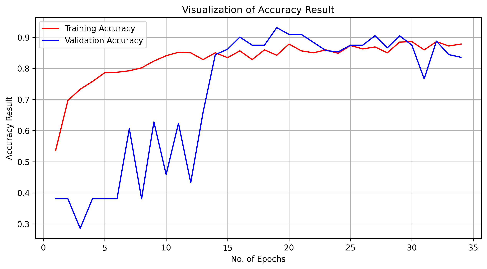
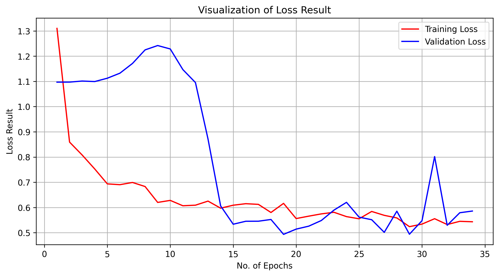
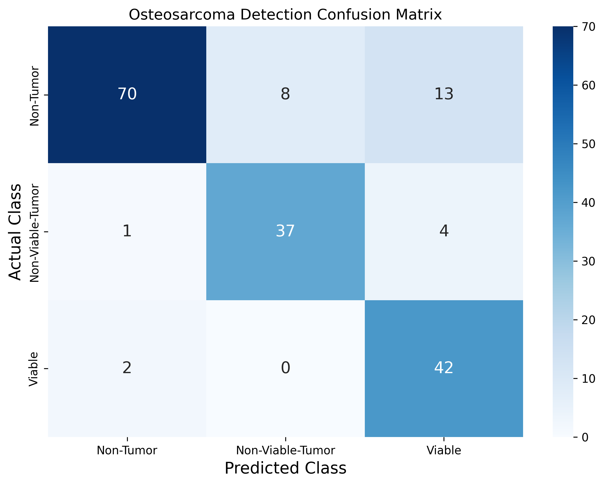
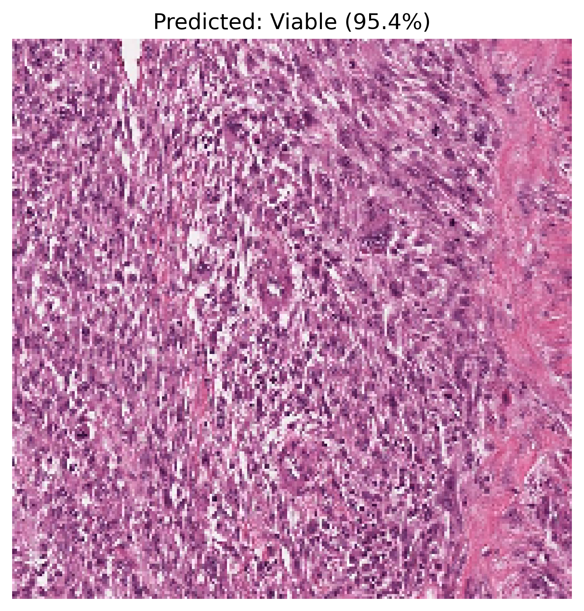

# Osteosarcoma using 5-Layer DCNN

This project implements a custom **Deep Convolutional Neural Network (DCNN)** to classify bone cancer histology images into three categories: **Non-Tumor**, **Non-Viable-Tumor**, and **Viable**.

---

## Model Performance & Visualization

### 1. Training Accuracy & Loss
The model uses **Label Smoothing** ($0.1$) to prevent over-fitting. Below is the visualization of the training history:

  
  

* **Validation Accuracy:** Achieved **89.61%**.
* **Observation:** The convergence of the red (Training) and blue (Validation) lines indicates a stable model with high generalization power.

### 2. Confusion Matrix
The confusion matrix shows exactly where the model is succeeding.

  

* **Analysis:** The "Non-Tumor" class shows the highest precision, while the model effectively distinguishes between Viable and Non-Viable tumor cells despite their visual similarities.

---

## Notebook Walkthrough (Cell-by-Cell)

### Cell 1-2: Environment & Data Setup
* **Purpose:** Configures the Kaggle API to download the [Osteosarcoma dataset](https://www.kaggle.com/datasets/gauravupadhyay0312/osteosarcoma).
* **Action:** Unzips the data into `/content/dataset` for high-speed local access in Colab.

### Cell 3-5: Preprocessing & Augmentation
* **ImageDataGenerator:** Applies random rotations, shifts, and flips. This "artificial variety" helps the model learn to ignore camera angles and focus on cellular structures.
* **Class Weights:** Since the dataset is imbalanced (more 'Non-Tumor' than others), we calculate weights so the model pays more attention to the minority classes.

### Cell 6: The 5-Layer DCNN Architecture
We use a sophisticated block design including:
* **Separable Convolutions:** To reduce parameter count while maintaining depth.
* **Squeeze-and-Excitation (SE) Blocks:** An attention mechanism that weights important feature channels more heavily.
* **Dual Paths:** Every block processes the image through both $3 \times 3$ and $5 \times 5$ filters simultaneously to capture different scales of cancer cells.

### Cell 7-10: Training & Callbacks
* **EarlyStopping:** Stops training if the `val_accuracy` stops improving for 15 epochs.
* **ReduceLROnPlateau:** Automatically drops the learning rate by half if the loss plateaus, allowing for "fine-tuning" in later stages.

### Cell 11-13: Evaluation & Prediction
* **Classification Report:** Provides Precision, Recall, and F1-Score.
* **Predict Function:** A custom utility that takes a raw image path and outputs a visualization with probability bars.

---

## Prediction Pipeline
The notebook includes a robust prediction function `predict_image()` that transforms raw histology slides into actionable data.

### How it works:
1. **Normalization:** The image is resized to $224 \times 224$ and rescaled ($1/255$).
2. **Softmax Output:** The model returns a probability distribution across the 3 classes.
3. **Visualization:** The code plots the image alongside a probability bar chart.

### Example Output: 
--> Actual_Class : Viable_Tumor

  

---

## How to Use
1. Clone this repo.
2. Upload your `kaggle.json` to the root directory.
3. Install dependencies: `pip install -r requirements.txt`.
4. Run `Osteosarcoma_5Layers_DCNN.ipynb` in Google Colab or Jupyter.
